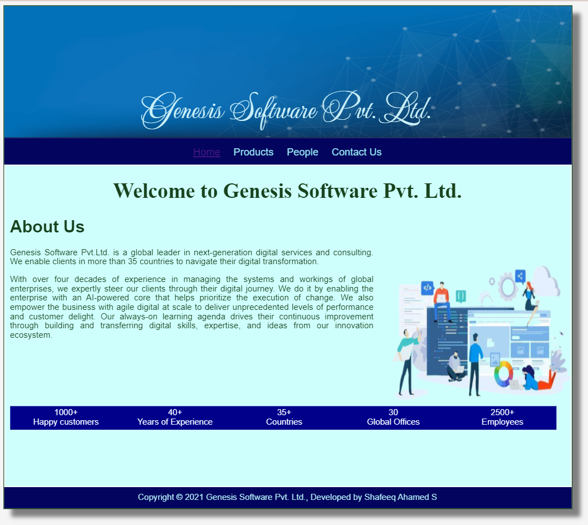
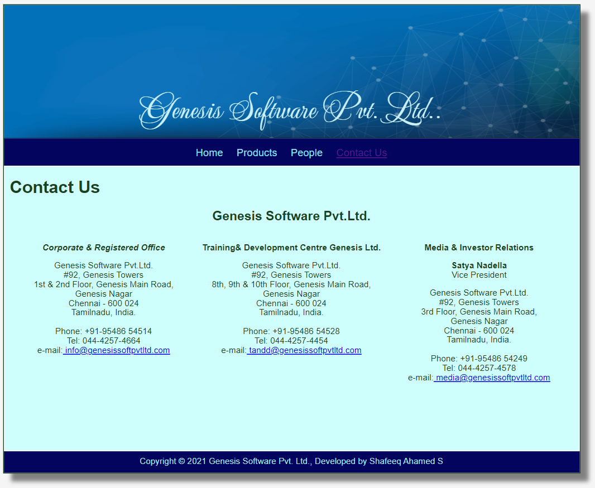

# 
Web Page for a Software Company

This project is a simple website that uses HTML and CSS to create a basic layout with 4 pages for the company.

## Comapany's Request
- Create a static website to showcase their products
- Website must include a Contact Us & People Pages
- The Brand colour of the company is blue.

## Technologies

* HTML
* CSS
* Django

## Screenshots

### Home Page:

### Products Page:

### People Page:

### Contact Us Page:

## Live Demo

[Live demo]()

## Source Code

The source code for the project is available on GitHub:

[GitHub repository](https://github.com/shafeeqahameds/productcompanywebsite)
